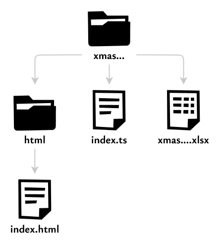

# Фотогенератор

Программа для генерации картинок с товарами (инфографики) для маркетплейсов по шаблону.

## Использование

Нужно подготовить:

1. Папку с фотографиями;

2. Заполненный эксель-файл;

3. Папку, в которой появятся созданные картинки.

Далее, нужно запустить программу со следующими аргументами:

| Аргумент               | Описание                                                       |
| ---------------------- | -------------------------------------------------------------- |
| -t, --template \<name> | Название шаблона (можно посмотреть в папках html или template) |
| -e, --excel \<path>    | Эксель-файл с описанием картинок                               |
| -p, --photos \<path>   | Папка с фотографиями                                           |
| -r, --result \<path>   | Папка, в которую будет помещён результат                       |

### Пример

```shell
node main.js -t xmas-decorations-set -e ./xmas-decorations-set.xlsx -p ./photos -r ./result
```

```shell
node -r tsconfig-paths/register -r ts-node/register ./src/main.ts -t xmas-decorations-set -e D:/photogen/xmas-decorations-set.xlsx -p D:/photogen/img/ -r D:/photogen/result/
```

## Как создать шаблон

### 1. Подготовка

Для начала, нужно представить, как будет выглядеть макет, сколько картинок будет на один товар, какая информация будет на этих картинках и т.д. То есть, максимально подробно описать шаблон. Лучше всего в виде макета в фигме, чтобы не пришлось дизайнить в процессе вёрстки HTML.

Например, был придуман такой макет для наборов ёлочных игрушек:


Пусть шаблон называется `xmas-decorations-set` и разрешение картинки равно 1500×2000 пикселей.

Далее, нужно описать структуру эксель-файла с параметрами, необходимыми шаблону. Его будут заполнять пользователи.

Эксель-файл нашего шаблона:


В столбце `G` находятся пути к фотографиям. При запуске программы пользователь укажет путь к папке с фотографиями, корнем считается она.

Дальше, нужно будет создать HTML-шаблон и написать класс, задачей которого будет передача информации из эксель-файла в веб-страницу.

Файловая структура шаблона выглядит так:



`xmas-decorations-set.xlsx` — пример шаблона, в коде никак не используется. Остальные файлы необходимы, подробности о них далее.

В папке `template` нужно создать папку с названием шаблона, в нашем случае, `xmas-decorations-set`.

### 2. Создание HTML-шаблона

В папке `template/xmas-decorations-set` создать папку `html`, в которой обязательно должен быть файл `index.html`.

В папке будет автоматически создаваться временная папка `temp`, в которую скопируются все фотографии из папки, указанной пользователем. Поэтому, путь к фото в `index.html` следует указывать с `temp/` в начале. Не надо называть так свою папку, потому что `temp` автоматически удаляется.

Необходимые параметры для шаблона должны приниматься через GET-параметры. Например, в нашем шаблоне есть следующие параметры:

| Название | Описание |
| - | - |
| textTop | Текст сверху названия |
| text | Название товара |
| textBottom | Текст снизу названия |
| quantity | Кол-во игрушек в наборе |
| height | Высота игрушек в наборе |
| photo | Путь к фото |
| color | Цвет текста |

Значит, адрес страницы будет выглядеть примерно так:

`.../xmas-decorations-set/html/index.html?text=Восточный<br>гороскоп&textTop=Набор...`

### 3. Создание класса шаблона

В папке `template/xmas-decorations-set`, создать файл `index.ts`.

Начать стоит с типов, так как их описать проще всего. Будут использоваться два типа: тип для входных параметров HTML-шаблона и тип, описывающий товар. Обычно, один товар представляет собой информацию из строки в эксель-файле.

Тип входных параметров HTML-шаблона:

```typescript
type XmasDecorationsSetHtmlProps = {
  text: string
  photo: string
  color: string
  isMain?: 'Да' | 'Нет'
  textTop?: string
  textBottom?: string
  quantity?: number
  height?: string
}
```

Тип для строк эксель-таблицы:

```typescript
export type XmasDecorationsSetProduct = {
  id: string
  textTop: string
  text: string
  textBottom: string
  quantity: number
  height: string
  photo: string
  color: string
  additional: Array<AdditionalPhoto>
}

type AdditionalPhoto = {
  text: string
  photo: string
  color: string
}
```

Далее, в этом файле создать экспортируемый по умолчанию класс, наследуемый от `Template`. При наследовании нужно передать в Template два типа, описанных выше. Далее, в нём надо будет прописать значения абстрактных свойств и реализовать два метода: `parseExcel()` и `processProduct()`.

Так будет выглядеть наш класс:

```typescript
export default class XmasDecorationsSetTemplate extends Template<XmasDecorationsSetProduct, XmasDecorationsSetHtmlProps> {
  name = 'xmas-decorations-set'
  width = 1500
  height = 2000
  products: XmasDecorationsSetProduct[] = []
  autoNumbering = true

  override async parseExcel(): Promise<XmasDecorationsSetProduct[]> {
    // Реализация
  }

  override async processProduct(product: XmasDecorationsSetProduct) {
    // Реализация
  }
}
```

Со свойствами всё достаточно просто.

`name` должен совпадать с названием папки с шаблоном.

`width` и `height` определяют размер окна в котором будет открываться HTML-шаблон.

`products` это массив товаров, полученных из эксель-файла.

`autoNumbering` включает автоматическую нумерацию выходных файлов. В конец имени каждого файла будет добавлен порядковый номер. Для каждого товара нумерация начинается сначала.

Далее, нужно реализовать два метода.

Метод `parseExcel()` должен превратить данные из эксель-файла в массив объектов типа `XmasDecorationsSetProduct` и вернуть его. Для парсинга эксель-файла автоматически создаётся объект класса `Excel.Workbook` из пакета `exceljs`. Он доступен через `this.workbook`. Файл, указанный пользователем, автоматически прочитается в этот объект.

Для генерации картинок нужно реализовать функцию `processProduct()`. Чтобы создать картинку, нужно вызвать метод `this.queueProduct()`, который принимает на вход объект типа `XmasDecorationsSetHtmlProps` и имя файла.

Сигнатура метода `queueProduct()`:

```typescript
queueProduct(htmlProps: XmasDecorationsSetHtmlProps, filename: string)
```

Пример использования `queueProduct()`:

```typescript
const filename = `${product.id} - ${product.text.replaceAll("<br>", " ")}`

this.queueProduct({
  isMain: 'Да',
  text: product.text,
  photo: product.photo,
  color: product.color,
  textTop: product.textTop,
  textBottom: product.textBottom,
  quantity: product.quantity,
  height: product.height,
}, filename)

product.additional.forEach((p: AdditionalPhoto) => {
  this.queueProduct({
    text: p.text,
    photo: p.photo,
    color: p.color
  }, filename)
})
```

Подробности реализации методов `parseExcel()` и `processProduct()` можно посмотреть в `template/xmas-decorations-set/index.ts`.

## Диаграмма классов


