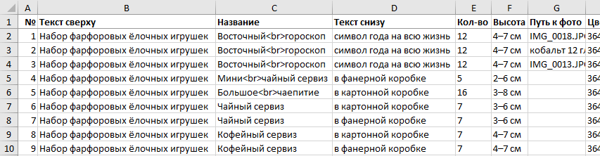
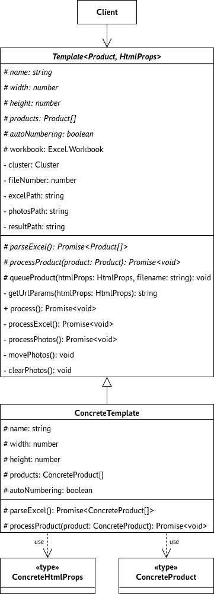

# Фотогенератор

Программа для генерации картинок с товарами (инфографики) для маркетплейсов по шаблону.

## Использование

Нужно подготовить:

1. Папку с фотографиями;

2. Заполненный эксель-файл;

3. Папку, в которой появятся созданные картинки.

Далее, нужно запустить программу со следующими аргументами:

| Аргумент               | Описание                                                       |
| ---------------------- | -------------------------------------------------------------- |
| -t, --template \<name> | Название шаблона (можно посмотреть в папках html или template) |
| -e, --excel \<path>    | Эксель-файл с описанием картинок                               |
| -p, --photos \<path>   | Папка с фотографиями                                           |
| -r, --result \<path>   | Папка, в которую будет помещён результат                       |

### Пример

```shell
node main.js -t wood -e ./wood.xlsx -p ./photos -r ./result
```

## Как создать шаблон

### 1. Подготовка

Для начала, нужно представить, как будет выглядеть макет, сколько картинок будет на один товар, какая информация будет на этих картинках и т.д. То есть, максимально подробно описать шаблон. Лучше всего в виде макета в фигме, чтобы не пришлось дизайнить в процессе вёрстки HTML.

Например, был придуман такой макет для наборов деревянных ёлочных игрушек:


Пусть шаблон называется `wood` и разрешение картинки равно 1800×2400 пикселей.

Далее, нужно описать структуру эксель-файла с параметрами, необходимыми шаблону. Его будут заполнять пользователи.

Эксель-файл нашего шаблона:



Всё, начиная со столбца `E`, является путями к фотографиям. При запуске программы пользователь укажет путь к папке с фотографиями, корнем считается она.

Дальше, нужно будет создать HTML-шаблон и написать класс, задачей которого будет передача информации из эксель-файла в веб-страницу.

### 2. Создание HTML-шаблона

В папке `html` нужно создать папку с названием шаблона, в нашем случае, `wood`.

В этой папке обязательно должен быть файл `index.html`.

В папке будет автоматически создаваться временная папка `temp`, в которую скопируются все фотографии из папки, указанной пользователем. Поэтому, путь к фото в `index.html` следует указывать с `temp/` в начале. Не надо называть так свою папку, потому что `temp` автоматически удаляется.

Необходимые параметры для шаблона должны приниматься через GET-параметры. Например, в нашем шаблоне есть следующие параметры:

| Название   | Описание                               |
| ---------- | -------------------------------------- |
| name       | Наименование товара                    |
| collection | Коллекция, к которой принадлежит товар |
| quantity   | Количество товаров в упаковке          |
| box        | Вид коробки                            |
| photo      | Путь к фото                            |
| icon       | Иконка на «ленточке». Необязательно.   |
| text       | Текст на «ленточке»                    |

Значит, адрес страницы будет выглядеть примерно так:

`.../html/wood/index.html?name=Имя&collection=Коллекция...`

### 3. Создание класса шаблона

В папке `template`, создать файл с названием шаблона, в нашем случае, `wood.ts`.

Начать стоит с типов, так как их описать проще всего. Будут использоваться два типа: тип для входных параметров HTML-шаблона и тип, описывающий товар. Обычно, один товар представляет собой информацию из строки в эксель-файле.

Тип входных параметров HTML-шаблона:

```typescript
type WoodHtmlProps = {
  name: string
  collection: string
  quantity: string
  box: 'Фанерная' | 'Картонная' | 'Фанерный домик'
  photo: string
  icon?: 'paintbrush' | 'leaf' | 'tree' | 'check' | 'gift' | 'shield'
  text: string
}
```

Тип для строк эксель-таблицы:

```typescript
type WoodProduct = {
  name: string
  collection: string
  quantity: string
  box: 'Фанерная' | 'Картонная' | 'Фанерный домик'
  photos: {
    onBox: string
    insideBox: string
    front: string
    back: string
    frontWithRuler: string
    backWithRuler: string
    box: string
    boxWithShavings: string
    onTree: string
  }
}
```

Далее, в этом файле создать экспортируемый по умолчанию класс, наследуемый от `Template`. При наследовании нужно передать в Template два типа, описанных выше. Далее, в нём надо будет прописать значения абстрактных свойств и реализовать два метода: `parseExcel()` и `processProduct()`.

Так будет выглядеть наш класс:

```typescript
export default class WoodTemplate extends Template<WoodProduct, WoodHtmlProps> {
  name = 'wood'
  width = 1800
  height = 2400
  products: WoodProduct[] = []
  autoNumbering = true

  override async parseExcel(): Promise<WoodProduct[]> {
    // Реализация
  }

  override async processProduct(product: WoodProduct) {
    // Реализация
  }
}
```

Со свойствами всё достаточно просто.

`name` должен совпадать с названием файла с классом и названием папки с HTML-шаблоном.

`width` и `height` определяют размер окна в котором будет открываться HTML-шаблон.

`products` это массив товаров, полученных из эксель-файла.

`autoNumbering` включает автоматическую нумерацию выходных файлов. В конец имени каждого файла будет добавлен порядковый номер. Для каждого товара нумерация начинается сначала.

Далее, нужно реализовать два метода.

Метод `parseExcel()` должен превратить данные из эксель-файла в массив объектов типа `WoodProduct` и вернуть его. Для парсинга эксель-файла автоматически создаётся объект класса `Excel.Workbook` из пакета `exceljs`. Он доступен через `this.workbook`. Файл, указанный пользователем, автоматически прочитается в этот объект.

Для генерации картинок нужно реализовать функцию `processProduct()`. Чтобы создать картинку, нужно вызвать метод `this.queueProduct()`, который принимает на вход объект типа `WoodHtmlProps` и имя файла.

Сигнатура метода `queueProduct()`:

```typescript
queueProduct(htmlProps: WoodHtmlProps, filename: string)
```

Пример использования `queueProduct()`:

```typescript
this.queueProduct({
  name: product.name,
  collection: product.collection,
  quantity: product.quantity,
  box: product.box,
  photo: product.photos.onBox,
  icon: 'gift',
  text: 'Идеально для подарка'
}, `${product.name}`)
```

Подробности реализации методов `parseExcel()` и `processProduct()` можно посмотреть в `template/wood.ts`.

## Диаграмма классов


